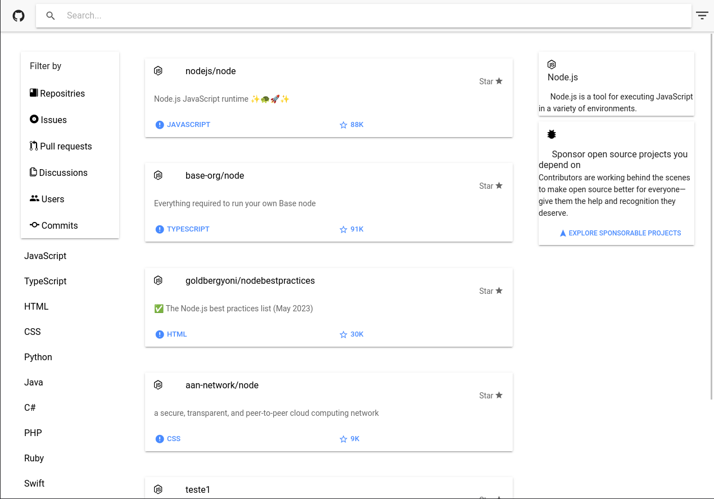
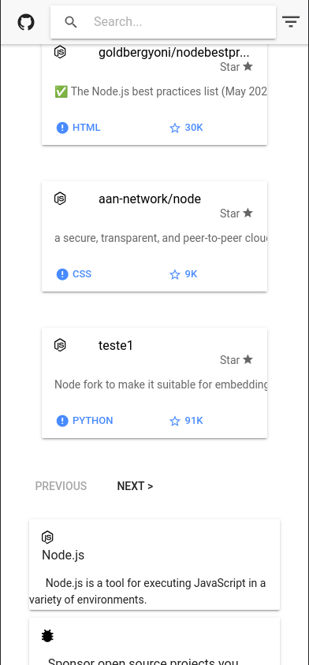

# Especificações do projeto

## Sobre o projeto

* ### Escolha do projeto
    <p>Para a criação do projeto em Ionic, utilizei o framework Angular e o Ionic Framework, que é baseado no Angular. Além disso, também utilizei o TypeScript para desenvolver o código, que permite o uso de tipagem estática e uma melhor organização do código.</p>

* ### Motivo da escolha
    <p>A escolha pelo Ionic foi feita por conta da facilidade de desenvolvimento de aplicativos móveis com um design moderno e interativo. Além disso, o Ionic oferece suporte a diversos plugins e bibliotecas que podem ser integrados com facilidade.</p>
* ### Princípios de engenharia de software
    <p>Ao desenvolver o projeto, utilizei alguns princípios da engenharia de software, como a separação de responsabilidades em diferentes componentes, a utilização de módulos para organizar o código e a utilização de boas práticas de programação para manter o código limpo e legível.</p>
* ### Dificuldades
    <p>Durante o desenvolvimento, enfrentei alguns desafios como a integração de diferentes bibliotecas e a implementação de algumas funcionalidades específicas. Para resolver esses problemas, pesquisei a documentação oficial e recorri a fóruns e comunidades para buscar soluções. </p>

## Como instalar

### Instaladores no Linux Versao 22.04

* Instalar o curl

    ```bash
    $ sudo apt install curl
    ```
* Donwload NVM

    ```bash
    $ curl https://raw.githubusercontent.com/creationix/nvm/master/install.sh | bash 
    ```
* Adicionando NVM ao PATH

    ```bash
    $ source ~/.profile
    ```
* Instalar versão 10.0.0 do Node.js

    ```bash
    $ nvm install v10.0.0
    ```
* Usar versão 10.0.0 do Node.js

    ```bash
    $ nvm use v10.0.0
    ```
* Versão do NPM e Node

    ```bash
    $ npm -v
    $ nvm -v
    ```
* Instalar Ionic e Cordova
    ```bash
    $ npm install -g ionic cordova
    ```
* Versão do Ionic e Cordova

    ```bash
    $ ionic -v
    $ cordova -v
    ```
### Inicialização
* Inicializar o projeto

    ```bash
    $ npm install -g ionic cordova
    $ ionic start nomedoprojeto sidemenu --type=ionic-angular
    ```
* Criar novas paginas

    ```bash
    $ ionic generate page repositorio
    ```
* Execultando o projeto
    ```bash
    $ ionic serve
    ```
## Esquemático do projeto

* Método Search
    <p>Para realizar uma pesquisa sobre um repositório foi inserido no inicio da página uma ferramenta de busca, que consiste em pegar o total de repositórios existentes  e fazer uma varredura usando a função filter que compara os caractere4s que foram digitados com os que tem disponível para exibição.</p>

    <div align="center">

    Modelo desktop responsivo.

    

    Modelo mobile responsivo.

    

    </div>
* Método Paginação e Listagem
    <p>Afim de uma melhor visualização para o usuário, foi soliciato que os repositorios que serestaão sendo exibidos na tela do usuário fossem apresentado em uma quantidade peq   uuena para que assim não ocorra o embaralçhamento de muitas informação em uma tela só, então eu decidir exibir apenas 5 repositorios por paginia, visto que o usuário pode clicar nos butões de next ou previous para ir adiante ou voltar nos repositórios listados. Esse método foi feito da seguinte maneira: é listado quandos items foram aparecidos na pesquisa, e entao é divido pelo o total  de itens máximo que pode aparecer em uma só tela, no caso 5, quando o número de repositórios passa de 5 , os próximos serão jogado para um a outra página, e assim por diante, evitanmdo o embralhamento de informações.</p>

    <div align="center">

    Filtro de pesquisa Desktop

    

    </div>
* Exibir um Repositório
    <p>Para exibir um repositório basta que o usuário click no card que o mesmo desejar abrir, logo irá abrir uma nmova página com informações sobre o repositorio desejado.</p>
* Método Filtro
    <p>O método filter  é capaza do usuario filtra se que buscar por repositórios, issues,users, commits e entre outros, para filtar basta que o usuário click no icone superior direto e assim daraessa oportunidade ao usuário de aplicar ofiltro que desejar. A imagem pode ser vista na secção "Método Paginação e Listagem".</p>
* Método Menu
    <p>No método no menu  que esta localizado no quanto superior esquerdo o usuário pode optar por entrar na paágina de login ou na paágina de pesquisa(principal).</p>
## Sobre
<p>Sou um estudante de Engenharia da Computação pela UFC Campus Quixadá, atualmente cursando o terceiro semestre. Tenho experiência em programação em diversas linguagens, como Python, Javascript,  C, C++ e Assembly, além de programação de microcontroladores com Arduino. Também possuo conhecimento avançado em HTML, CSS e Sass, além de habilidades em gerência de vendas, elaboração de projetos, informática básica e aplicada, pacote Office, programação para aplicativo e web, Ionic, banco de dados Firebase, montagem e manutenção de computadores, habilidades em Linux, habilidades em Git, Sourcetree, VS Code, Angular, Node.js e Canvas. Além disso, possuo experiência com programação de projetos(um deles favorecido pelo o Ministério de Desenvolvimento Regional) no IFCE - campus Boa Viagem e na startup Corredores Digitais</p>

### Contato
* email: elitonp.melo@gmail.com
* celular: (88) 994862894 